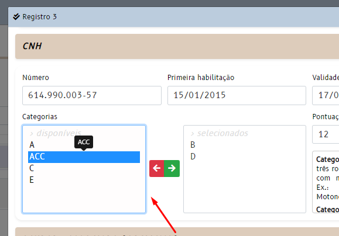

# MULTIPLE

React component for a custom HTML form select element - integrated, multiple selection, responsive

> 

## Dependencies

- React (used 17.0.2)
- Reactstrap (used 8.10.0)
- Font Awesome (used 5.9.0)
- function module (helper)

## Component input (props)

- **optionsData**: json data, specify current element options data
	- must be an ARRAY

- **optionsKeys**: specify property keys in optionsData
	- **id**: unique, the option ID
	- **name**: option mandatory description
	- **description1**: optional extra description (first)
	- **description2**: optional extra description (second)
	- **active**: Boolean optional, show or not current option (default show)

- **optionsSelected**: current element selected options
	- must be an ARRAY

- **id**: React form element ID

- **handleFormElements**: Parent state hook function that controls the form element data

- **disabled**: optional, element is enabled or disabled (default enabled)

- **terminators**: optional, terminator for options text concatenating string (if any)
	- name, description1, description2, active
	- Default values:

		```
		[
			['', ''], // name
			[' - ', ''], // description1
			[' - ', ''], // description2
			[' (', ')'] // active
		]
		```

## Example

```
import Multiple from 'components/_common/_form/Multiple';

	...

	const [formElements, handleFormElements] = useState(
		{
			...
			categorias: ...
			...
		}
	);

	...

	<Row form>
		<Col md={ 8 }>
			<FormGroup>
				<Label for="multiple-box-out-categorias">Categorias</Label>
				<div id="categorias" data-value={ formElements.categorias }>
					<Multiple
						optionsData={ data.options && data.options.categorias }
						optionsKeys={
							{
								id: 'id',
								name: 'categoria'
							}
						}
						optionsSelected={ formElements.categorias }
						id="categorias"
						handleFormElements={ handleFormElements }
					/>
				</div>
			</FormGroup>
		</Col>

		...
```
